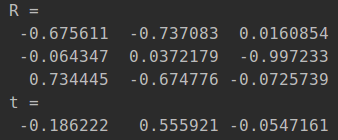

# How to use
## Step 0:
Place the unpacked package into a ros workspace and compile it with the following command

```
catkin_make --pkg camera_laser_calibration
```

If you get a cv_bridge error then uncomment line 12 of Cmakelists.txt
If it says ceres is not installed, please follow the official ceres instructions to install it

## Step 1:
Go to the ros workspace

```
source devel/setup.bash
```

Then run

```
roslaunch camera_laser_calibration collect_laser_image_data.launch
```
Go to the directory of the bag file you want to use for calibration and run
```
rosbag play --pause XXX.bag
```

Remember to use the spacebar to control the play and pause of the bag at this point

Open a new terminal and start rqt
Select **Plugins/Configuration/Dynamic Reconfiguration**

Eventually you will see the following two screens in rviz and rqt to indicate success, where images and laser coloured lines appear in rviz and the control screen appears in rqt


## Step 2

If you don't want to read the text, you can just watch the demo video How_to_use.mp4 in the root directory

**pause bag playback**

Select the point of the laser by going to **2D Nav Goal** in the rviz toolbar. After selection it will show something like this at the first terminal that starts the calibration process


[ INFO] [1534164489.163120940]: Setting goal: Frame:laser, Position(**1.575, -0.752**, 0.000), Orientation(0.000, 0.000, -0.688, 0.725) = Angle. -1.518

Please copy the bolded part to the pasteboard
and switch to the rqt interface and paste it into the box to the right of laser_coor, if this is the example above, the paste should show 1.575, -0.752

**Check the Save button**
The image corresponding to the current laser will pop up and you will need to tick a small rectangular box, when this is done the feature points will pop up and the coordinate points will be detected, then press the space bar against the image window and the window will disappear
The data will be saved automatically in the data/data_v2.txt folder in **x y u v** format


## Step 3
Calibration
Make a copy of data/data_v2.txt into data.txt

```
roslaunch camera_laser_calibration calibration.launch
```

Calibration results
``Tcl: The result is the external reference from the lidar to the camera, which is automatically saved in the data folder ``



## Step 4
Reprojection to check the calibration results

```
roslaunch camera_laser_calibration reprojection_test.launch
```
will automatically launch rviz and the reprojection image will be posted as a rosmsg message


Translated with www.DeepL.com/Translator (free version)