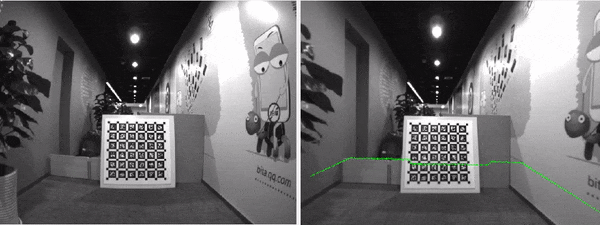
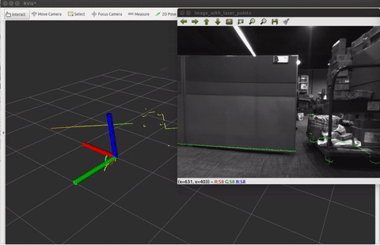

## Camera Lidar Calibration Tool ROS Version.


Author:xinliangzhong(xinliangzhong@foxmail.com)





# Wie verwenden
## Schritt 0.
Legen Sie das entpackte Paket in einen ros-Workspace und kompilieren Sie es mit dem folgenden Befehl

```
catkin_make --pkg camera_laser_calibration
```

Wenn Sie einen cv_bridge-Fehler erhalten, entfernen Sie das Kommentarzeichen in Zeile 12 von Cmakelists.txt
Wenn es heißt, dass ceres nicht installiert ist, folgen Sie bitte den offiziellen ceres-Anweisungen, um es zu installieren

## Schritt 1.
Gehen Sie zum Arbeitsbereich ros

```
source devel/setup.bash
```

Dann laufen

```
roslaunch camera_laser_calibration collect_laser_image_data.launch
```
Wechseln Sie in das Verzeichnis der Beuteldatei, die Sie für die Kalibrierung verwenden möchten, und führen Sie
```
rosbag play --pause XXX.bag
```

Denken Sie daran, die Leertaste zu benutzen, um die Wiedergabe und die Pause des Beutels an dieser Stelle zu steuern

Öffnen Sie ein neues Terminal und starten Sie rqt
Wählen Sie **Planung/Konfiguration/Dynamische Rekonfiguration**.

Schließlich werden Sie die folgenden beiden Bildschirme in rviz und rqt sehen, um den Erfolg anzuzeigen, wobei Bilder und farbige Laserlinien in rviz erscheinen und der Kontrollbildschirm in rqt angezeigt wird


## Schritt 2

Wenn Sie den Text nicht lesen wollen, können Sie sich einfach das Demo-Video How_to_use.mp4 im Stammverzeichnis ansehen

**Wiedergabe der Tasche unterbrechen**

Wählen Sie den Punkt des Lasers aus, indem Sie **2D Nav Goal** in der rviz-Symbolleiste wählen. Nach der Auswahl wird am ersten Terminal, das den Kalibrierungsprozess startet, etwas wie folgt angezeigt


[INFO] [1534164489.163120940]: Ziel setzen: Frame:laser, Position(**1.575, -0.752**, 0.000), Orientierung(0.000, 0.000, -0.688, 0.725) = Winkel: -1.518

Bitte kopieren Sie den fettgedruckten Teil in die Zwischenablage
und wechseln Sie zur rqt-Schnittstelle und fügen Sie sie in das Feld rechts neben laser_coor ein. Im obigen Beispiel sollte die Einfügung 1,575, -0,752 anzeigen

**Kreuzen Sie die Schaltfläche Speichern an**
Das Bild, das dem aktuellen Laser entspricht, wird eingeblendet, und Sie müssen ein kleines rechteckiges Kästchen ankreuzen. Wenn Sie dies getan haben, werden die Feature-Punkte eingeblendet und die Koordinaten werden ermittelt.
Die Daten werden automatisch im Ordner data/data_v2.txt im Format **x y u v** gespeichert.


## Schritt 3
Kalibrierung
Erstellen Sie eine Kopie von data/data_v2.txt in data.txt

```
roslaunch camera_laser_calibration calibration.launch
```

Ergebnisse der Kalibrierung
``Tcl: Das Ergebnis ist die externe Referenz vom Lidar zur Kamera, die automatisch im Datenordner gespeichert wird ``

! [Reprojektion](Ergebnisse/Optimierung_Ergebnis.png)

## Schritt 4
Reprojektion zur Überprüfung der Kalibrierungsergebnisse

```
roslaunch camera_laser_calibration reprojection_test.launch
```
startet automatisch rviz und das Reprojektionsbild wird als rosmsg-Nachricht versendet
! [demo0](ergebnisse/rotation.gif)
